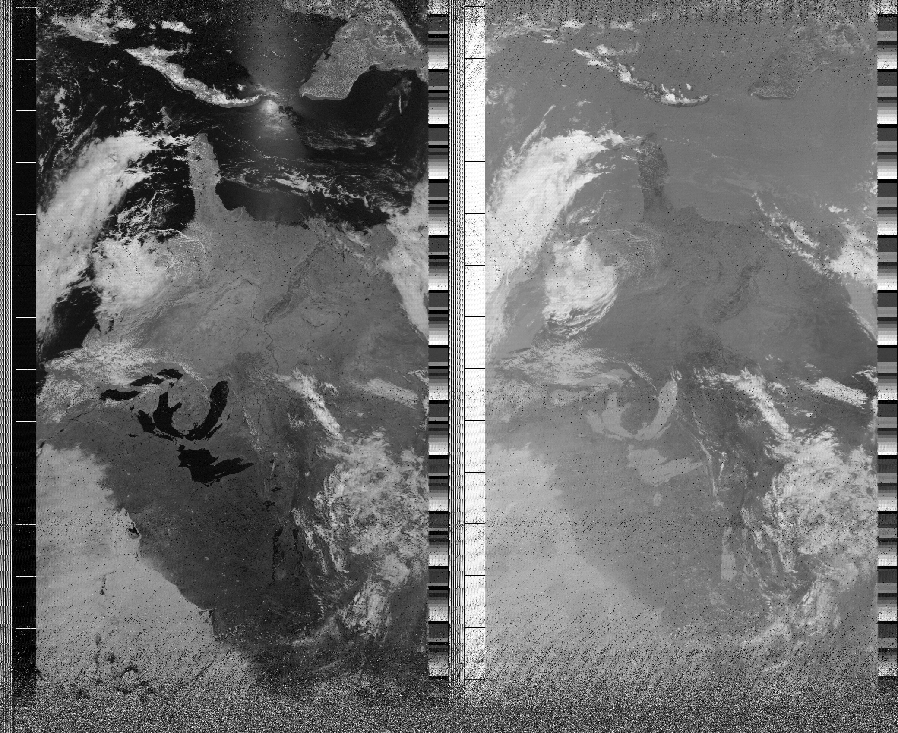

# NOAA APT Decoder

Decode analog, APT signals from the NOAA weather satellites.

Images are decoded from WAV files with a sample rate of 20800Hz. Files can be
resampled using two methods.

## Installation on Linux

    sudo apt install git
    pip install pillow numpy scipy
    git clone https://github.com/zacstewart/apt-decoder
    cd apt-decoder

## Resampling

- Method 1: Using a Python script with no additional dependencies.

      cd apt-decoder
      python3 resample.py recording.wav resampled.wav

- Method 2: Using [SoX](http://sox.sourceforge.net/) and a bash script. This
  method is faster and filters the signal to improve the quality of the image.

      sudo apt install sox
      cd apt-decoder
      ./resample.sh recording.wav resampled.wav

## Usage

    cd apt-decoder
    python3 apt.py resampled.wav image_out.png

Images will probably look upside down if the satellite passed from south to
north instead of north to south. In fact, the following examples are upside
down.

## Examples

## Alternatives

You can also try [wxtoimg](http://wxtoimg.com/) but looks dead.

Alternatively [atp-dec/apt-dec](https://github.com/csete/aptdec) works really
good. Keep in mind that the [1.7
release](https://github.com/csete/aptdec/releases) looks newer than the [repo's
master branch](https://github.com/csete/aptdec).
